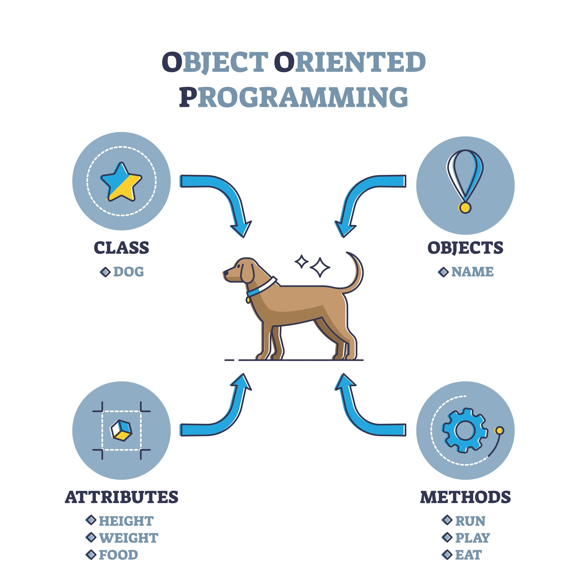

* Isso abre o **Preview do Markdown** ao lado do editor.
   - Ctrl + Shift + V

# 📓 Notas de Estudo: Arquitetura e POO

### 🧠 Decisões Técnicas
1. **Herança vs Interface**:
   - Usamos **Herança** para `Desenvolvedor` porque ele **é um** `Funcionario`.
   - Usamos **Interface** (`IPagavel`) porque tanto `Funcionario` quanto `PrestadorServico` **devem ser pagos**, embora tenham origens totalmente diferentes.
   
2. **Uso de Static**:
   - O `InputHelper` é uma classe estática porque funciona como uma "ferramenta de balcão": você entra, usa e sai, sem precisar criar (instanciar) um objeto na memória.

### 🚀 Insights para o SeDaConta
- **Desacoplamento**: Ao usar a interface `IPagavel` no `Program.cs`, o "financeiro" não precisa saber detalhes internos de cada classe, apenas chamar o método do contrato.
- **TDD**: Manter os testes verdes durante a refatoração de pastas deu a segurança necessária para mudar a arquitetura sem medo de errar os cálculos.

### ⚠️ Alerta de Namespace
Sempre que mover uma classe de pasta (ex: de `Classes` para `Models`), deve-se atualizar:
1. O `namespace` no topo do arquivo.
2. O `using` nos arquivos que chamam essa classe.

# Alguns conceitos importantes

## Orientado a Objetos — POO (→ baseado em objetos)

Este é o coração do .NET.
A ideia é aproximar o código do mundo real, agrupando dados e comportamentos em objetos.

Como funciona
Em vez de ter variáveis e funções soltas, como:

   string nome
   Imprimir(string n)

Você cria uma classe Pessoa que possui:

   a propriedade Nome
   o método Imprimir()

### Os 4 Pilares da POO
1. Abstração
   Trazer apenas o que é importante do mundo real para o código.

2. Encapsulamento
   Esconder detalhes internos e proteger os dados.

3. Herança
   Criar novas classes baseadas em classes existentes.

4. Polimorfismo
   Um mesmo método pode se comportar de formas diferentes em objetos distintos.

Analogia
   Pense em um carro:
   Você não precisa saber como o motor funciona por dentro → encapsulamento
   Você interage apenas com volante, pedais e painel → interface/objeto

## Estrutura da nomeação dos projetos dentro de uma solução única
À medida que seu sistema evolui, é muito comum adicionar mais projetos à mesma solução. Veja um exemplo real de como uma aplicação cresce:

   MinhaApp.Web: Onde fica o site (Frontend).
   MinhaApp.API: Onde ficam os serviços de dados.
   MinhaApp.Core: Onde ficam as classes de negócio (como a sua classe Pessoa).
   MinhaApp.Data: Onde fica a conexão com o banco de dados.
   MinhaApp.Tests: Onde ficam os testes de tudo isso.

## Nomenclatura C#
1. PascalCase vs. camelCase
   A regra geral no C# é simples: quase tudo o que é "público" ou "grande" usa PascalCase.

   PascalCase: Todas as palavras começam com maiúscula (MinhaClasse, NomeDoUsuario).
   camelCase: A primeira palavra começa com minúscula (minhaVariavel, valorTotal).

2. Convenção para Classes e Arquivos

   Nome da Classe: Deve ser em PascalCase e, de preferência, um substantivo no singular.
      Errado: Pessoas ou classesPessoa
      Correto: Pessoa

   Nome do Arquivo: Deve ser exatamente igual ao nome da classe dentro dele.
      Exemplo: Se a classe é Pessoa, o arquivo deve ser Pessoa.cs.

   Dica: Evite usar palavras genéricas como "Classes" no nome do arquivo ou da pasta. O compilador já sabe que é uma classe pela extensão .cs.

3. Convenção para Pastas (Namespaces)
   As pastas no .NET representam a organização lógica do seu projeto (os Namespaces).

   Use PascalCase para nomes de pastas.

   Se você tem várias classes de entidades, uma pasta chamada Models ou Entities é o padrão de mercado.

      ProjetoConsole/
      ├── Models/              <-- Pasta em PascalCase
      │   └── Pessoa.cs        <-- Nome do arquivo = Nome da classe
      ├── Services/
      │   └── Calculadora.cs
      └── Program.cs

| **Item**                 | **Padrão** | **Exemplo**                 |
| ------------------------ | ---------- | --------------------------- |
| **Classes**              | PascalCase | ``UsuarioAdmin``            |
| **Métodos**              | PascalCase | ``SalvarDados()``           |
| **Propriedades**         | PascalCase | ``IdadeUsuario``            |
| **Variáveis Locais**     | camelCase  | ``contadorItens``           |
| **Argumentos de Método** | camelCase  | ``(string ``nomeDigitado)`` |
| **Pastas/Namespaces**    | PascalCase | ``MeusTreinamentos.Core``   |

## TDD desde o inicio
1. Criar um Projeto de Testes
   No terminal, dentro da sua pasta principal (onde está o .sln), você deve criar um novo projeto específico para testes (o padrão de mercado é usar o framework xUnit).

   Execute estes comandos:

   Bash
      ### 1. Cria o projeto de testes
      dotnet new xunit -o Aula04.Tests

      ### 2. Adiciona o projeto de testes à sua Solução
      dotnet sln add Aula04.Tests/Aula04.Tests.csproj

      ### 3. Faz o projeto de Testes "enxergar" o seu projeto Aula04
      dotnet add Aula04.Tests/Aula04.Tests.csproj reference Aula04/Aula04.csproj
2. O Ciclo do TDD (Red, Green, Refactor)
   O TDD não é apenas escrever testes, é um fluxo de trabalho:

      Red (Vermelho): Você escreve um teste para uma função que ainda não existe ou que ainda não funciona. O teste vai falhar.
      Green (Verde): Você escreve o código mínimo necessário na classe Pessoa para o teste passar.
      Refactor (Refatorar): Você melhora o código que escreveu, garantindo que o teste continue passando.

## Laços de repetição
Quando usar cada um?
Para não confundir mais:

for: Use quando você sabe o limite. "Repita isso 10 vezes", "Percorra esta lista de 50 nomes".

`while`: Use quando o fim depende de um fator externo. "Repita enquanto o banco de dados estiver conectado".

`do while`: Use quando a ação precisa ocorrer antes da primeira checagem. "Tente conectar ao servidor, se falhar, tente de novo enquanto o erro persistir".

Curiosidade: O ``foreach`
No .NET, você verá muito o foreach. Ele é uma variação do for usada exclusivamente para percorrer coleções (como uma lista de nomes) de forma ainda mais simples, sem precisar de um contador i.

   C#
   string[] nomes = { "Ana", "Beto", "Caio" };

   foreach (var nome in nomes)
   {
      Console.WriteLine(nome);
   }

## Instanciamento
A Instância é o momento em que a ideia sai do papel e se torna real. Para entender onde ela se encaixa, vamos usar uma analogia clássica:

Imagine uma Planta de uma Casa (o desenho técnico):

A Classe é a planta (o molde). Ela diz que a casa terá 2 quartos, uma porta e uma cor.

A Instância é a casa construída na rua X, número Y. Você pode tocar nela, morar nela e pintar a parede dela de azul sem que a casa do vizinho (outra instância) mude de cor.

### O Ciclo de Vida:
   1. Classe: Definida no seu arquivo .cs (estática, não ocupa memória de dados).
      // 1. Classe (O molde)
      public class Cachorro {
         public string Nome;
         public void Latir() { Console.WriteLine($"{Nome} disse: AU AU!"); }
      }
   2. Instanciação: O comando new reserva um bloco na memória RAM.
      // 2. INSTÂNCIA (O ato de criar o objeto na memória)
      Cachorro meuPet = new Cachorro();
   3. Objeto (Instância): Vive na memória enquanto estiver sendo usado.
      meuPet.Nome = "Rex";
      meuPet.Latir();
   4. Garbage Collector (Lixeiro do .NET): Quando você não usa mais essa instância, o .NET a remove da memória automaticamente (o isolamento e gerenciamento que falamos lá no início!).
