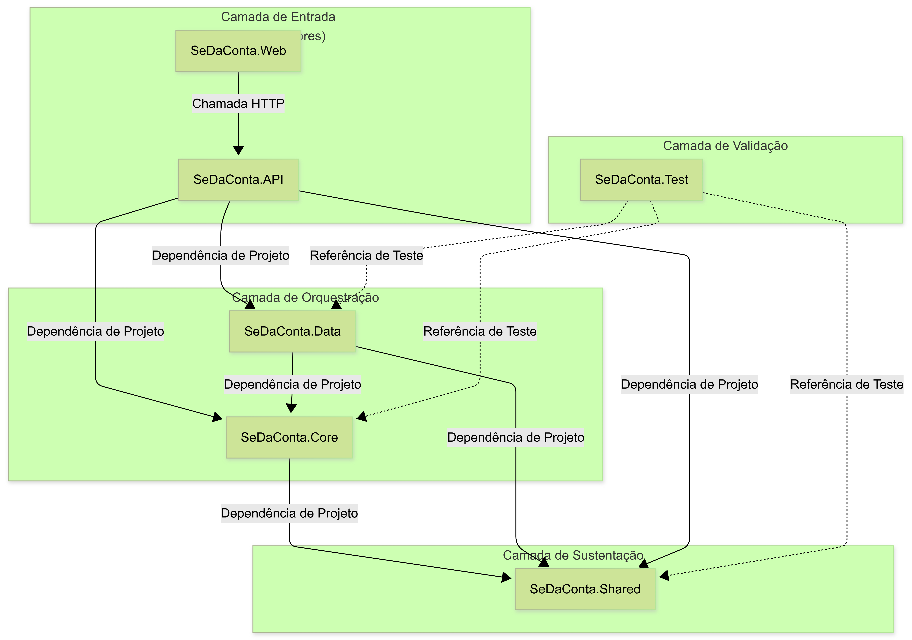

* Isso abre o **Preview do Markdown** ao lado do editor.
   - Ctrl + Shift + V

# 📂 Mapa da Arquitetura: Organização por Responsabilidade

O projeto segue um padrão modular para facilitar a manutenção e o crescimento (Escalabilidade).

## Resumo Comparativo

| Característica | Python (venv)                 | .NET                                    |
|----------------|-------------------------------|-----------------------------------------|
| Isolamento     | Manual (precisa ativar o venv)| Automático (baseado no projeto)         |
| Versão do SDK  | Frequentemente ligada ao venv | Definida no .csproj ou global.json      |
| Bibliotecas    | Instaladas na pasta do venv   | Cache centralizado, linkadas por projeto|

## E se eu quiser levar para outro PC?
- Se você quiser o isolamento máximo (onde nem o .NET precisa estar instalado no PC de destino), você pode usar o modo Self-Contained:

    dotnet publish -c Release -r win-x64 --self-contained true

- Isso gera uma pasta com o seu programa mais todos os arquivos do .NET necessários. É o nível supremo de isolamento: o programa vira um pacote independente que não depende de nada instalado no sistema operacional.

### 🏗️ 1. Models (Entidades)
Contém os objetos reais do domínio. Responde à pergunta: *"O que o sistema é?"*
- `Funcionario.cs` (Abstrata): Base para tipos de funcionários.
- `Desenvolvedor.cs` / `Gerente.cs`: Especializações (Herança).
- `PrestadorServico.cs`: Entidade externa que também gera despesa.

### 🔌 2. Interfaces (Contratos)
Define comportamentos comuns. Responde à pergunta: *"O que o objeto faz?"*
- `IPagavel.cs`: Garante que qualquer classe que a assine terá o método `CalcularPagamento()`. Permite tratar objetos diferentes (CLT e PJ) na mesma lista financeira.

### 🛠️ 3. Util (Ferramentas)
Contém utilitários genéricos (Helpers) para suporte técnico.
- `InputHelper.cs`: Centraliza validações de `Console` (Nome, Salário, CPF) para evitar repetição de código (DRY - Don't Repeat Yourself).

### 🔬 4. Aula04.Test (Qualidade)
Pasta dedicada ao TDD. Garante que mudanças na estrutura não quebrem a lógica de cálculo.

# Estruturas visuais

## Pastas do projeto
PROJETO_RAIZ
├── .gitignore          <-- O filtro de lixo
├── Projeto.slnx        <-- A cola que une App e Testes
├── AppContabil/        <-- Seu código principal
│   ├── Program.cs
│   ├── Models/         <-- O que o sistema é (Dados)
│   ├── Services/       <-- O que o sistema faz (Regras/Cálculos)
│   ├── Interfaces/     <-- Os contratos (IPagavel, IValidavel)
│   ├── Util/           <-- Suas ferramentas (InputHelper)
│   └── Docs/           <-- Documentação (.md)
└── AppContabil.Test/   <-- Seus testes unitários

## Nomes dos projetos do 
   MinhaApp.Web: Onde fica o site (Frontend).
   MinhaApp.API: Onde ficam os serviços de dados.
   MinhaApp.Core: Onde ficam as classes de negócio (como a sua classe Pessoa).
   MinhaApp.Data: Onde fica a conexão com o banco de dados.
   MinhaApp.Tests: Onde ficam os testes de tudo isso.

   O padrão que você verá no mercado (e que recomendo para o SeDaConta) é deixar essas pastas no nível raiz do projeto. Isso facilita a visualização imediata da arquitetura:

##
`SeDaConta.Models`: O coração (os dados: Funcionário, Nota Fiscal, Imposto).
`SeDaConta.Services`: O cérebro (a regra: CalculadoraImpostoService, EnquadramentoTributarioService).
`SeDaConta.Util`: As ferramentas (o suporte: ValidadorCnpj, InputHelper).

# 🏗️ Arquitetura do Projeto: SeDaConta
Este documento descreve a organização da solução SeDaConta, utilizando o padrão de arquitetura em camadas para garantir escalabilidade, testabilidade e separação de responsabilidades.

## 📂 Hierarquia de Pastas e Projetos

PROJETO_RAIZ (Pasta SeDaConta)
├── .gitignore                  <-- Filtro para não subir bin/obj e arquivos de usuário
├── SeDaConta.slnx              <-- Arquivo de Solução (unifica todos os projetos)
│
├── SeDaConta.Core/             <-- Camada de Domínio (Class Library)
│   ├── Models/                 <-- Entidades de negócio (Empresa, Funcionario, Taxa)
│   ├── Interfaces/             <-- Contratos de serviços e repositórios
│   ├── Services/               <-- Regras de negócio puras (Cálculos de impostos, bônus)
│   └── Exceptions/             <-- Tratamento de erros específicos do domínio
│
├── SeDaConta.Data/             <-- Camada de Infraestrutura (Class Library)
│   ├── Context/                <-- Configuração do Entity Framework e PostgreSQL
│   ├── Repositories/           <-- Implementação da persistência (SQL/Acesso ao Banco)
│   ├── Migrations/             <-- Histórico de versionamento do banco de dados
│   └── Mappings/               <-- Configuração de tabelas (Fluent API)
│
├── SeDaConta.API/              <-- Porta de Entrada/Serviços (Web API)
│   ├── Controllers/            <-- Endpoints da aplicação (Ex: EmpresasController.cs)
│   ├── DTOs/                   <-- Objetos de transferência (Data Transfer Objects)
│   ├── Middleware/             <-- Filtros de autenticação e logs
│   └── Program.cs              <-- Inicialização da API e Injeção de Dependência
│
├── SeDaConta.Shared/           <-- Utilitários Transversais (Class Library)
│   ├── Extensions/             <-- Métodos de extensão (Strings, Datas, Números)
│   ├── Validators/             <-- Validadores genéricos (CPF, CNPJ, E-mail)
│   ├── Helpers/                <-- Ferramentas de apoio (Criptografia, Formatação)
│   └── Constants/              <-- Valores fixos usados em múltiplos projetos
│
├── SeDaConta.Web/              <-- Camada de Apresentação (Blazor ou React)
│   ├── Pages/                  <-- Páginas da interface de usuário
│   ├── Components/             <-- Componentes reutilizáveis de UI
│   ├── Services/               <-- Consumidores da API (HttpClient)
│   └── wwwroot/                <-- Arquivos estáticos (CSS, JS, Imagens)
│
└── SeDaConta.Test/             <-- Camada de Qualidade (xUnit)
    ├── UnitTests/              <-- Testes de lógica do Core e Shared
    ├── IntegrationTests/       <-- Testes de integração com Banco de Dados e API
    └── Mocks/                  <-- Simuladores para isolamento de testes

## 🔗 Fluxo de Dependências
Para manter o código desacoplado, seguimos a regra de dependência de "fora para dentro":

``Shared``: Não depende de ninguém. Todos podem depender dele.
``Core``: Depende apenas do Shared. É o projeto mais isolado.
``Data``: Depende do Core (para conhecer as entidades) e do Shared.
``API``: Depende do Core, Data e Shared. É o ponto de união.
``Web``: Depende da API (via chamadas HTTP) e pode compartilhar DTOs do Shared.

## 🛠️ Notas de Implementação
``Shared vs Core``: Use o Shared para códigos que você poderia levar para qualquer outro projeto (ex: validar CPF). Use o Core para códigos que só existem por causa da contabilidade (ex: regra do Simples Nacional).
``Encapsulamento``: Mantenha os construtores no Core protegidos com validações para garantir que nenhuma Empresa seja criada sem os dados obrigatórios.
``Manutenção``: Se precisar trocar o banco de dados futuramente, apenas o projeto SeDaConta.Data sofrerá alterações.

## 🔑 As 3 Diferenças que você precisa entender:
    Onde fica o Program.cs?
        No Core e no Data, você não terá um Program.cs. Eles são "bibliotecas". Eles não rodam sozinhos; eles são "chamados" por alguém.

    O Program.cs existirá apenas na API (que sobe o servidor) e no Web (que sobe o site).

    A questão das Models:
        As suas classes principais (Empresa.cs, Funcionario.cs) ficam apenas no Core.

    A API e o Data apenas "referenciam" o Core. Você não as escreve de novo. Se mudar no Core, muda para todo mundo.

    A pasta Util:
        Geralmente, criamos um projeto extra chamado SeDaConta.Shared ou mantemos dentro do Core se for algo muito específico da regra de negócio.

### 💡 Como eles se "conversam"? (Referências)
    No .NET, você faz isso:
        A API referencia o Core e o Data.
        O Data referencia o Core.
        O Web referencia apenas a API (via internet/HTTP).
        O Test referencia todo mundo para poder testar.

### 💡 Como ficaria a hierarquia de dependências?
    Pense no Shared como o nível 0:

        SeDaConta.Shared: Não referencia ninguém.
        SeDaConta.Core: Referencia o Shared.
        SeDaConta.Data: Referencia o Core e o Shared.
        SeDaConta.API: Referencia o Core, Data e Shared.

### Resumo da Abordagem Profissional
    No seu projeto SeDaConta, a minha recomendação para começar de forma limpa é:

    Evite a pasta Util solta: Se a ferramenta for para formatar um documento contábil, coloque em SeDaConta.Core/Services/Helpers.

    Use o Shared para o que é "infraestrutura": Se você criar um código para converter arquivos PDF ou enviar e-mails, isso vai para o SeDaConta.Shared.

    `Dica de Sênior:` Se você olhar para uma classe e conseguir imaginar ela sendo usada em um projeto de padaria, de oficina ou de contabilidade, ela é Shared. Se ela só faz sentido para contabilidade, ela é Core.

### 🎨 Entendendo a Simbologia (As Linhas)
    1. Linhas Preenchidas (Contínuas) — ==>
    Representam uma Dependência de Projeto Fortemente Acoplada.

    O que significa: O projeto A "enxerga" as classes do projeto B em tempo de compilação.

    No contexto: Quando a API tem uma linha contínua para o Core, significa que dentro do código da API você pode fazer using SeDaConta.Core.Models;. Sem essa linha (referência), o código nem compila.

    Custo: Se você mudar algo no Core, a API precisa ser recompilada obrigatoriamente.

    2. Linhas de Seta Única (Finass) — -->
    Representam uma Comunicação Via Protocolo (Desacoplada).

    O que significa: O projeto Web não conhece as classes do projeto API. Ele apenas envia uma "mensagem" (via JSON/HTTP).

    No contexto: Se você mudar o banco de dados da API, o projeto Web não precisa mudar nada, desde que a mensagem (o JSON) que ele recebe continue igual. Isso é o que permite você usar Blazor, React ou um celular para falar com a mesma API.

    3. Linhas Pontilhadas — -.->
    Representam uma Referência de Teste ou Injeção de Dependência.

    O que significa: É uma relação "conforme a necessidade". O projeto de Test não faz parte do sistema que vai para o cliente (produção). Ele apenas "espiona" os outros projetos para ver se estão funcionando.

    No contexto: Usamos a linha pontilhada para indicar que o teste está de fora, observando o comportamento interno sem interferir na lógica de negócio.

### 🚀 Melhoria na Distribuição (A "Hierarquia de Poder")
    Para o SeDaConta ser profissional, a hierarquia deve seguir a Regra da Cebola (Onion Architecture):

    Nível 0 (O Centro): SeDaConta.Shared. É a base de tudo, não depende de ninguém.
    Nível 1: SeDaConta.Core. Depende apenas do Shared. É onde mora sua inteligência contábil.
    Nível 2: SeDaConta.Data. Depende do Core para saber o que salvar no banco.
    Nível 3 (A Casca): SeDaConta.API. Depende de todos para unir as peças.
    Nível 4 (O Satélite): SeDaConta.Web. Fica flutuando fora da solução técnica, comunicando-se apenas por "sinais" (HTTP).

### 💡 Por que isso é importante para você?
    Se você começar a construir o SeDaConta e tentar fazer o Core depender da API, você criará uma Dependência Circular. O Visual Studio vai dar um erro e o seu projeto vai "travar".

    Entender essas linhas agora evita que você cometa o erro de misturar código de banco de dados (Data) dentro da lógica de cálculo (Core).

### 💡 Por que esta visão é poderosa?
    Independência: Note que o Core não aponta para ninguém (exceto o Shared). Isso significa que você pode testar toda a lógica de contabilidade sem precisar de internet, sem banco de dados e sem tela.

    Substituibilidade: Se você decidir trocar o Web (Blazor) por um aplicativo mobile (MAUI) daqui a um ano, você joga fora apenas a pasta .Web. Todo o resto (API, Core, Data, Shared) permanece intacto.

    Segurança de Dados: O Shared garante que um CNPJ inválido nem chegue ao Core, economizando processamento e evitando sujeira no banco de dados.

    Essa estrutura é o que você usará para transformar o seu projeto de estudo no SeDaConta real. O próximo passo natural, quando você se sentir confortável, será criar esses projetos dentro da sua Solution (.slnx).

