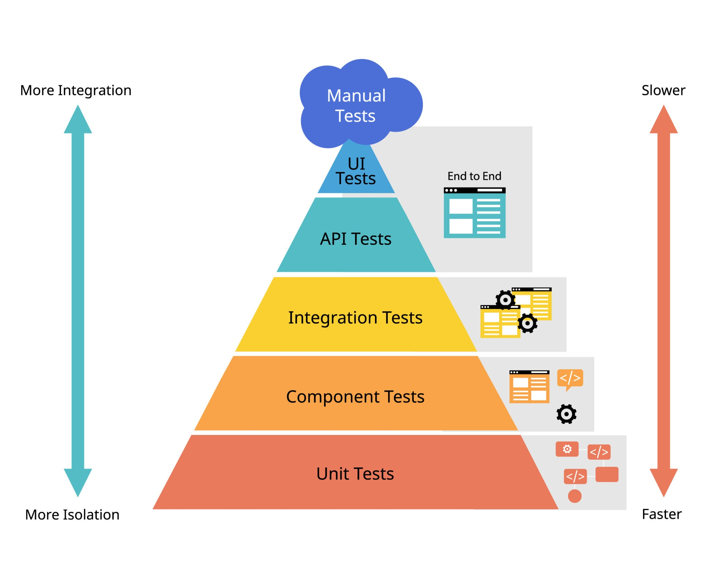
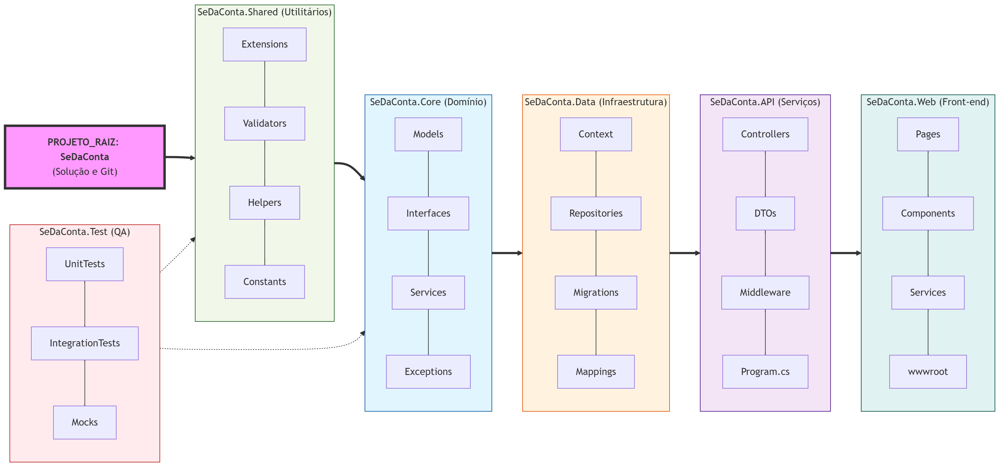

* Isso abre o **Preview do Markdown** ao lado do editor.
   - Ctrl + Shift + V

# Fluxo de tratamentos diversos
Idéias de tratamentos diversos
## ✔ Encaminhar ERROS para uma classe de tratamento
    Sim — e isso é o que sistemas profissionais fazem.

    Você pode ter uma classe como:

        ```c#
        public static class LogErros
        {
            public static void Registrar(Exception ex)
            {
                // salvar em arquivo
                // enviar para banco
                // enviar para API de logs
                // enviar para e-mail
                // etc.
            }
        }
        ```

    E no seu catch:

        ```c#
        catch (Exception ex)
        {
            LogErros.Registrar(ex);
            Console.WriteLine("Ocorreu um erro inesperado.");
        }
        ```

## ✔ Encaminhar erros “por baixo dos panos”
    Também é comum.

    Você pode ter:
        um middleware (em APIs)
        um handler global
        um EventLog
        um serviço de telemetria (Application Insights, Serilog, NLog, Seq, etc.)

    Exemplo simples com um método interno:

        ```c#
        catch (Exception ex)
        {
            TratarErroInterno(ex);
            Console.WriteLine("Erro inesperado.");
        }

        void TratarErroInterno(Exception ex)
        {
            // rotina oculta
            // grava log, envia alerta, etc.
        }
        ```

    O usuário nem sabe que isso está acontecendo.

## ✔ Encaminhar erros com códigos personalizados
    Você pode criar sua própria classe de erro:

    ```c#
    public class ErroSistema
    {
        public string Codigo { get; set; }
        public string Mensagem { get; set; }
        public DateTime Data { get; set; }
    }
    ```
    
    E no catch:

    ```c#
    catch (Exception ex)
    {
        var erro = new ErroSistema
        {
            Codigo = "ERR001",
            Mensagem = ex.Message,
            Data = DateTime.Now
        };

        LogErros.Registrar(erro);
    }
    ```
Isso é muito usado em **sistemas corporativos**.

# Testes

## Resumo de Nomenclatura para fixar:
* [Theory]: Atributo para testes parametrizados.
* [InlineData]: Fornece os valores para os parâmetros da Teoria.
* Campo Privado: Armazena o estado interno da classe (segurança).
* Propriedade: A "interface" pública para ler ou escrever nos campos.

    ```c#
    [Theory]
    [InlineData(1000.00, 1000.00)] // Menor que 1500: Sem desconto
    public override...
    private override...
    ```

## xUnit tem outro atributo muito famoso chamado [Theory].

- [Fact]: É usado para um teste que testa uma única condição específica.
- [Theory]: É usado quando você quer testar o mesmo método com vários dados diferentes (ex: testar se a soma funciona para os números 2, 5, 10 e -1 de uma vez só).

## Amplitude dos testes
1. Testes Unitários vs. Testes de Integração
    No diagrama, as setas pontilhadas focam no Core porque lá estão os seus Testes Unitários.

    O objetivo: Testar a lógica pura. Ex: "Se eu passar 10 horas a 50 reais para o PrestadorServico, ele me devolve 500?".

    Por que não conectar no Data ou API aqui? Porque se o seu teste unitário depender do Banco de Dados (Data) e o banco estiver fora do ar, o seu teste vai falhar. Mas a culpa não é do seu código de cálculo, é da conexão! O teste unitário deve ser rápido e independente de cabos ou internet.

2. O Teste de Integração (Onde as setas se multiplicam)

Test Pyramid with User Interface Tests, Integration Tests and Unit Tests

    Existe uma parte do projeto SeDaConta.Test chamada IntegrationTests. Nela, as setas realmente se conectam com quase tudo:

        Ele conecta no API para ver se a rota /empresa responde.
        Ele conecta no Data para ver se o dado realmente "entrou" no PostgreSQL.
        Ele conecta no Core para validar o resultado final.

3. Por que no Fluxograma a seta foca no Core?
    Porque o Core é a parte mais importante de ser testada no SeDaConta.

        Se o site (Web) tiver um erro de cor, o cliente reclama.

        Se a API cair, o sistema fica lento.

        MAS, se o Core calcular um imposto errado, a empresa do seu cliente pode ser multada ou fechar.

        Por isso, na hierarquia de importância, o Teste "beija" o Core. Ele garante que a inteligência do negócio está blindada.

4. A "Teoria da Pirâmide de Testes"
    Para o seu projeto profissional, pense assim:

        Base da Pirâmide (Muitos Testes): Conectam-se apenas ao Core e Shared. São rápidos e testam cada detalhe.
        Meio da Pirâmide (Alguns Testes): Conectam-se ao Data e API. Testam se as peças se encaixam.
        Topo da Pirâmide (Poucos Testes): Conectam-se ao Web. Testam o fluxo do usuário do início ao fim (End-to-End).



